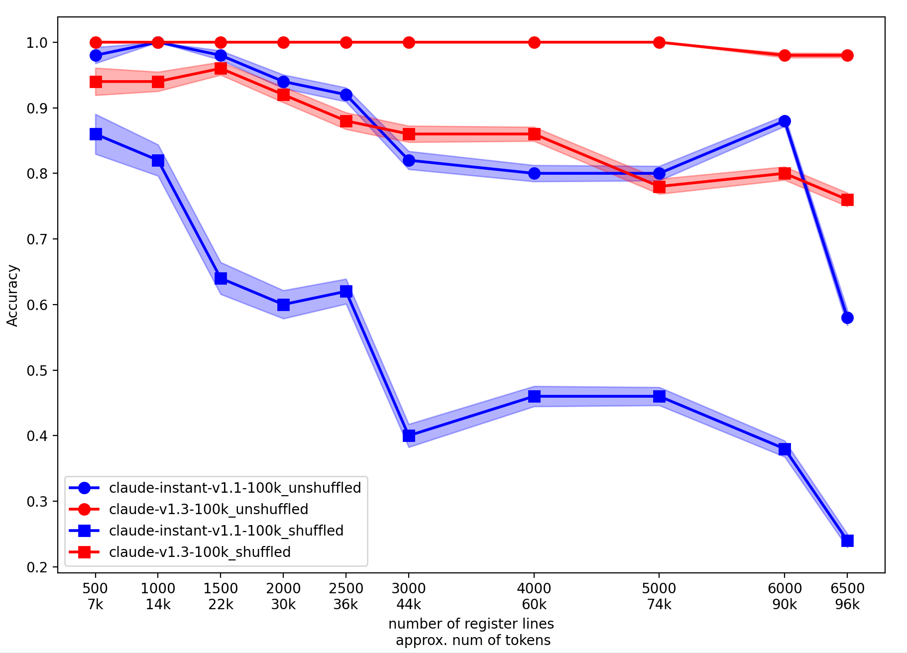
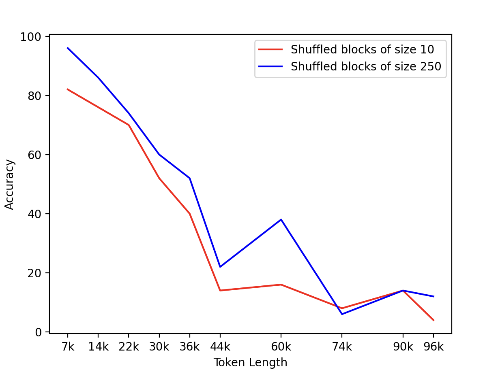

# A Little Retrieval Test for Large Language Models


This repository showcases an experiment conducted using the Anthropic API to assess a Claude's ability to recall specific lines from a generated text file, in both orderly and shuffled contexts.

This experiment aims to investigate the recall abilities of language models (beyond Claude), particularly in the context of long text sequences. The ability of a model to accurately recall  information from distant parts of the input text can be crucial for many tasks, especially those that involve understanding and manipulating complex contexts.

At the core of this experiment, we're interested in assessing how well the models can retrieve specific pieces of information from random parts of a long text. We don't claim that this is reflective of real-world tasks, but it will be a fun test to try out.

## Experiment Design

To test a model's retrival capabilities, we generate long sequences of text where each line contains a piece of information ("REGISTER_CONTENT") and a unique identifier. At a random point in the text, we insert an instruction that needs to be executed. That instruction request the model to "go to" a specic (randomly selected) line of the context, and report the contents of that line.

The lines may or may not be ordered, and the "go to" command is not necessarily at the start or end of the text. This is to ensure that the model cannot simply attend to the first or last token in the text to find the "go to" command, which might be possible if we always placed the command at the start or end and early/late tokens enjoy global attention.

We also introduce a variation of the experiment where the lines are shuffled, as we hypothesize that ordered lines might provide a stronger signal to the attention mechanism, guiding it towards the relevant information. 

We initiate the experiment by generating a text file with each line following the format:

```
line {i}: REGISTER_CONTENT is <{random.randint(1, 10000)}>
```

At a random point in the file, we insert a line that says:

```
[EXECUTE THIS]: Go to line {i} and report only REGISTER_CONTENT, without any context or additional text, just the number, then EXIT
```

The language model is then prompted with the text file's content, and its output is compared to the expected REGISTER_CONTENT value.

Here is how a sample prompt looks like

```
Testing Long Context

line 1: REGISTER_CONTENT is <2156>
line 2: REGISTER_CONTENT is <9805>
[EXECUTE THIS]: Go to line 5 and report only REGISTER_CONTENT, without any context or additional text, just the number, then EXIT
line 3: REGISTER_CONTENT is <6668>
line 4: REGISTER_CONTENT is <1432>
line 5: REGISTER_CONTENT is <6727>
line 6: REGISTER_CONTENT is <3936>
line 7: REGISTER_CONTENT is <1805>
line 8: REGISTER_CONTENT is <431>
line 9: REGISTER_CONTENT is <1720>
line 10: REGISTER_CONTENT is <6794>

```

## Testing in a Shuffled Context

To evaluate the model's ability to recall content in a shuffled context, we alter the text file by randomly shuffling the lines. The structure of each line and the execute command remains the same. Below is an example of a shuffled text file:

```
Testing Long Context

line 7: REGISTER_CONTENT is <53914>
line 3: REGISTER_CONTENT is <21221>
line 1: REGISTER_CONTENT is <72318>
line 9: REGISTER_CONTENT is <32901>
line 4: REGISTER_CONTENT is <63509>
line 8: REGISTER_CONTENT is <34620>
line 6: REGISTER_CONTENT is <90474>
[EXECUTE THIS]: Go to line 9 and report only REGISTER_CONTENT, without any context or additional text, just the number, then EXIT
line 10: REGISTER_CONTENT is <54099>
line 2: REGISTER_CONTENT is <18859>
line 5: REGISTER_CONTENT is <36058>
```

## Experiment Procedure

For each test, the model is provided with the generated text file's content as a prompt. The model's output is then compared to the expected REGISTER_CONTENT value (after a simple regex to obtain only the retrieved number from the output of the model). If the model's output matches the expected value, the test is considered successful. If the model's output does not match the expected value, the line in the prompt containing the incorrect output value provided by the model is returned and the mistake is printed out.

The tests are conducted across different values of n, the number of lines in the text file, starting from 500 (roughly 7k tokens) up to 6500 (roughly 97k tokens). The token count is according to anthropic's token_count function. These tests are performed several times (50 in particular for the figures that follow) for each value of n to ensure some statistical validity. You will notice however that even averaging over 50 times, the curves are not very smooth. The success rate, defined as the percentage of correct matches over the total number of tests, is then calculated for each model and each value of n.


## Experiment Results


The following models were tested during the experiment:

1. claude-instant-v1.1-100k
2. claude-v1.3-100k

We only tested on anthropic's models because of the easy of api calls and a suite of different models at the 100k context length range.

After conducting the experiment for both orderly and shuffled contexts, we collected the results and averaged the performance of the tested models. Here, we present the findings based on the accuracy of each model as a function of the number of lines in the text file and the order of these lines.

<p align="center">

</p>

To further explore how the locality among lines affects the performance of the models, we also tried grouping lines in blocks of size B and then shuffling the blocks instead. We found that larger blocks seem to help the models, which is an expected outcome.

<p align="center">

</p>

# How do I run the LRT?

To run the little_retrieval_test.py script:

- Ensure Python (3.7 or later) is installed.
- Install the required Python libraries (os, random, anthropic, re, matplotlib, requests). Use pip install <library-name>.
- Save the script as little_retrieval_test.py.
- Navigate to the directory containing the script in a terminal or command prompt.
- Run the script using python little_retrieval_test.py.
- BOOM! 

## Conclusion

The Little Retrieval Test (LRT) provides an interesting and simple way to assess the basic retrieval capabilities of language models in long contexts. The experiment results highlight the differences in performance between the tested models and show how factors such as locality and context length can impact their retrieval abilities.

You can find the complete code and run the experiment yourself

The ideas for this experiment were developed jointly with [Kangwook Lee (UW-Madison)](https://kangwooklee.com) and [Jy-yong Sohn (Yonsei Unviersity)](https://itml.yonsei.ac.kr/professor), and [yours truly](https://papail.io). This project was developed during a short-term visit (and in fact a weekend of that visit) at [Krafton](https://www.krafton.com), in Seoul.

We'll be likely running more tests based on and around the LRT, and we may (or may not) update this in near the future.

## Disclaimer: 
The LRT is not supposed to test extensively the reasoning and retrieval capabilities for language models, nor do we suggest this as a replacement for more comprehensive test. It is a simple test that perhaps tells us more about a model when it performs poorly at it, rather than a model that performs great at it (in fact it is likely that a small language model can be trained to only do this successfully).
